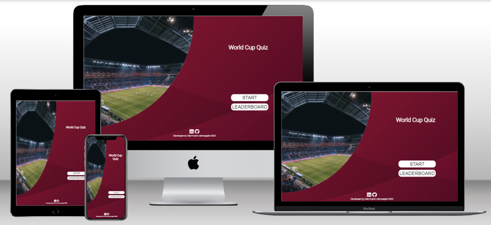

# __World Cup Quiz__

Welcome to **World Cup Quiz**. Having the football world cup 2022 at the end of the year, there is no better time to test your football knowledge.



[Live link to website](https://giankpetrov.github.io/WorldCupQuiz/)

## __Tech Stack__

 **VS Code**
 **Gitpod**
 **Git**
 **HTML5**
 **CSS3**
 **JavaScript**
 **Figma**


## __UX/UI & Design__

### __Target Audience__

The Quiz is targeted to football fans who also understand english language with a estimated [4 Billion fans](https://www.worldatlas.com/articles/what-are-the-most-popular-sports-in-the-world.html). The Quiz will be used for entertainment but can also be used by those who would like to learn more about FIFA World Cup Tournament.

### __User Stories__

- As a user, I would like to be able to see clearly how to start the game.
- AS a user, I would like to check the Leaderboard.
- As a user, I would like to be able to see instructions before start the game.
- As a user, I would like to know which is the current question number.
- As a user, I would like to know how many questions are in the Quiz.
- As a user, I would like to see my current score when the game started.
- As a user, I would like to see clearly the question and available choices.
- As a user, I would like to see which choice I am in before final selection.
- As a user, I would like to be able to go to main page if the game already started.
- As a user, I would like to be able to go to next question after finishing the current question.
- As a user, I would like to see my final score after finishing the Quiz.
- As a user, I would like to save my score with my name.

### __Wireframes__

I used [Figma](https://www.figma.com/) to create wireframes for the website. 

The original idea was always to demonstrate the capabilities of JavaScript over the DOM (Document Object Model) manipulation. In order to do so, I decide to design the project as one page websites with a single HTML file with multiple sections that will work as different stages or scenarios.

<p align="center">
  <kbd>
    
  </kbd>
</p>

<p align="center">
  <kbd>
    
  </kbd>
</p>

<p align="center">
  <kbd>
    
  </kbd>
</p>

<p align="center">
  <kbd>
    
  </kbd>
</p>

<p align="center">
  <kbd>
    
  </kbd>
</p>

<p align="center">
  <kbd>
    
  </kbd>
</p>

<p align="center">
  <kbd>
    
  </kbd>
</p>

<p align="center">
  <kbd>
    
  </kbd>
</p>

Mobile wireframes were made and taking also in consideration Large, Medium and Small smartphones.
<p align="center">
  <kbd>
    
  </kbd>
</p>
<p align="center">
  <kbd>
    
  </kbd>
</p>


### __Color Scheme__

I used [Coolors.co](https://coolors.co/) to keep a control on the color scheme selected.

The selection of colors start having as starting point the flag colors for the next FIFA World Cup Host, **Qatar**.

<kbd>

</kbd>
### __Contrast Checker__

I used [Coolors.co](https://coolors.co/) contrast checker tool having a very good result of 8.91.
<kbd>

</kbd>

### __Features__

- __Favicon__
    - The favicon is a simple ball of football.
<kbd>
    
</kbd>

- __Front Page buttons__
    - Buttons in the front page allows the user to start the game or visualizer the Leaderboard.
<kbd>

</kbd>

- __Instructions__
    - A panel displaying all instructions need it in order to play.
<kbd>

</kbd>

- __Instructions buttons__
    - Buttons in the instruction section allows the user to start the game or go back to main page.
<kbd>

</kbd>

- __Scoreboard__
    - Scoreboard display current question number, total questions and current score.
<kbd>

</kbd>

- __Question and choices__
    - This game area display the current question and possible choices.
<kbd>

</kbd>

- __Hover indicator__
    - This feature help to visualize which choice are you currently in before final selection.
<kbd>

</kbd>

- __Extra Information__
    - Extra information is displayed to provide more context to the current question and correct answer.
<kbd>

</kbd>

- __Game Buttons__
    - There are two buttons in the game area, one to return to front page and another one to advance to next question in the quiz.
<kbd>

</kbd>

- __Save Score Form__
    - At the end of the quiz the user is presented with a form to save their final score or paly again.
<kbd>

</kbd>

- __Leaderboard__
    - On the scoreboard you can see all scores and buttons that allows the user to play again or go back to front page.
<kbd>

</kbd>

### __Future development__

- __Database implementation__
    - This will allow record all scores from all user that complete the quiz.

- __Incorrect answer penalty__
    - This will take X amount of points for each incorrect choice selected.

- __Add further questions__
    - This will allow more quiz combinations and test wide knowledge on the subject.


## __Testing__

For visualize testing results [here.](TESTING.md)

## __Deployment__

The site was deployed to GitHub pages. The steps to deploy are as follows:

- In the **[GitHub repository](https://github.com/giankpetrov/WorldCupQuiz)**, navigate to the Settings tab
- From the source section drop-down menu, select the Main Branch, then click "Save".
- The page will be automatically refreshed with a detailed ribbon display to indicate the successful deployment.

The live link can be found [here](https://giankpetrov.github.io/WorldCupQuiz/)

The website is hosted using GitHub pages, deployed directly from the master brach.

### Run Locally

Clone the project by following the next command on Bash

```bash
  git clone https://github.com/giankpetrov/WorldCupQuiz
```
## __Credits__

### Code

- Starting idea for page functionality from Brian Design [here.](https://www.youtube.com/watch?v=f4fB9Xg2JEY)
- Project reviewed for code structure and logic from Harry-Leepz [here.](https://github.com/Harry-Leepz/StarWars-Quizapp)
- Project reviewed for code structure and logic from StevenWeir038 [here.](https://github.com/StevenWeir038/Scientia-Geographia-Quiz)

### Design

- Favincon made with [Favicon.io](https://favicon.io/)
- Color palette from [Coolors](https://coolors.co/)
- Font from [Google Fonts](https://fonts.google.com/)
- Concept design idea from Thao Dinh Phuong @ Figma.com [here.](https://www.figma.com/community/file/1087374049999321283)
- Button Design from Clement Owireku-Bogyah @ Uiverse.io [here.](https://uiverse.io/detail/Zena4L/heavy-yak-65#)
- Tech Stack Icons [github.com/Marwin1991](https://github.com/marwin1991/profile-technology-icons)

### Media

- Images from [Pexels](https://www.pexels.com/)


## Acknowledgements

**[Harry Dhillon](https://github.com/Harry-Leepz)** for being my mentor on this project and provide excellent feedback from real work experience.

